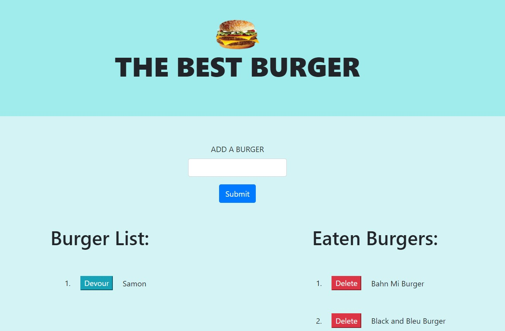

# Best-BURGER


A web application using node, handlebars, express, mySQL, and ORM



## Installation

Clone the repo

Install all npm modules using the command "npm install".

Create your mySQL database.

Run the server ```node server.js```

## Functionality

### Usage

 View the deployed app [here](https://the-best-burger.herokuapp.com//)

### Adding New Burgers
Users can add additional burger entries to the database by simply adding a new burger.

### Devoring a Burger
Users can move the burger from the left to the right of the page by clicking on the "Devour" button.

### Deleting A Burger
Users can remove burgers from both the database and the "Eaten Burgers" column by clicking the delete button next to the burger. 


